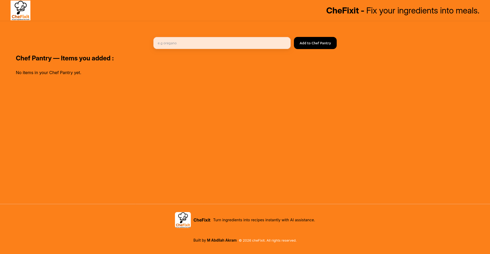
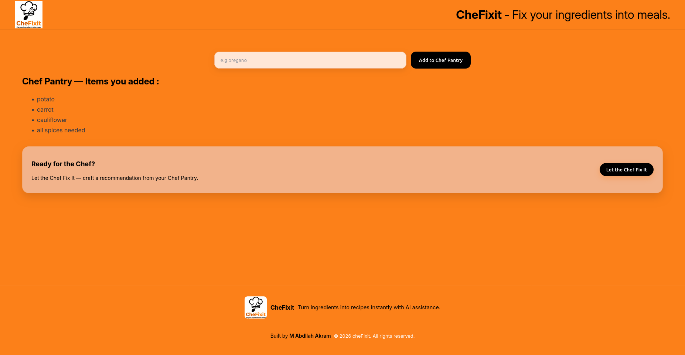
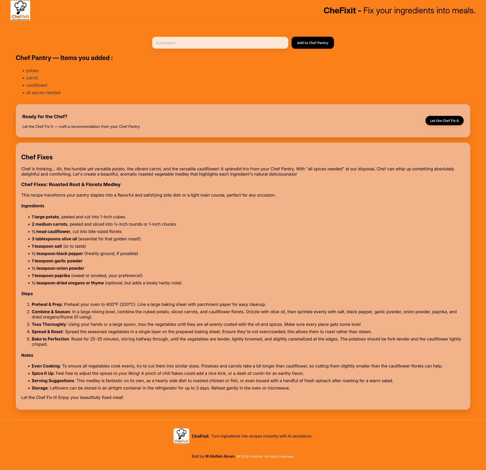

# CheFixit

**Fix your ingredients into meals.**

---

## 📌 Overview

**CheFixit** is a smart recipe generator web application that transforms your available kitchen ingredients into complete meals.

Instead of searching recipes manually, users simply enter the ingredients they have, and the system generates a suitable recipe using **Google Gemini API**.

---

## 🚀 Core Idea

- User enters available ingredients (minimum **4 ingredients required**)
- The app processes input using AI (Gemini API)
- A complete recipe is generated including:
  - Meal name
  - Ingredients usage
  - Step-by-step instructions

---

## ✨ Features

- 🧾 Ingredient-based recipe generation
- 🤖 AI-powered suggestions using **Gemini API**
- ⚛️ Dynamic React UI
- 🧠 Smart validation (minimum 4 ingredients required)
- 🔄 Real-time state updates
- 🎯 Clean and responsive user experience

---

## 🛠️ Tech Stack

- **Frontend:** React.js
- **AI Integration:** Google Gemini API
- **Styling:** CSS (if used)
- **State Management:** React Hooks (useState, useEffect)

---

## 📚 What I Learned

While building this project, I gained hands-on experience with:

- 🎯 **Event Listeners** (handling user input and actions)
- 🧠 **State Management** using React Hooks
- 🔄 **Conditional Rendering** (showing UI based on API response)
- 🧾 **Forms Handling** in React
- ⚙️ **Component-based architecture**
- 🧩 **State-driven UI updates**
- 🤖 **Integrating external AI APIs (Gemini API)**
- 📦 **Data flow management between components**

---

## 🖼️ Screenshots

### 🧩 Logo


---

### 🏠 Homepage
User enters available ingredients in the input form.



---

### 🧾 Ingredients Entered
User has added ingredients (minimum 4 required).



---

### 🍽️ Generated Recipe
AI-generated recipe using Gemini API based on entered ingredients.



---

## ⚙️ How It Works

1. User enters at least 4 ingredients
2. Clicks on **"Get Recipe"**
3. React handles form submission and state update
4. Gemini API generates a recipe based on input
5. Recipe is displayed dynamically on screen

---

## 🚀 Getting Started

### 1. Clone the repository
```bash
git clone https://github.com/m-abdullah-akram/chefixit.git
````

### 2. Install dependencies

```bash
npm install
```

### 3. Add environment variables

```bash
GEMINI_API_KEY=your_api_key_here
```

### 4. Run the project

```bash
npm start
```

---

## 🎯 Future Improvements

* ❤️ Save favorite recipes
* 🧑‍🍳 User accounts & history
* 🌍 Cuisine-based filtering
* 🛒 Auto grocery list generator
* 🎤 Voice-based ingredient input

---

## 🤝 Contribution

Feel free to fork the project and improve it. Pull requests are welcome.

---

## 👨‍💻 Author

**[Muhammad Abdullah Akram]** -- Developed as part of a React.js project series

---