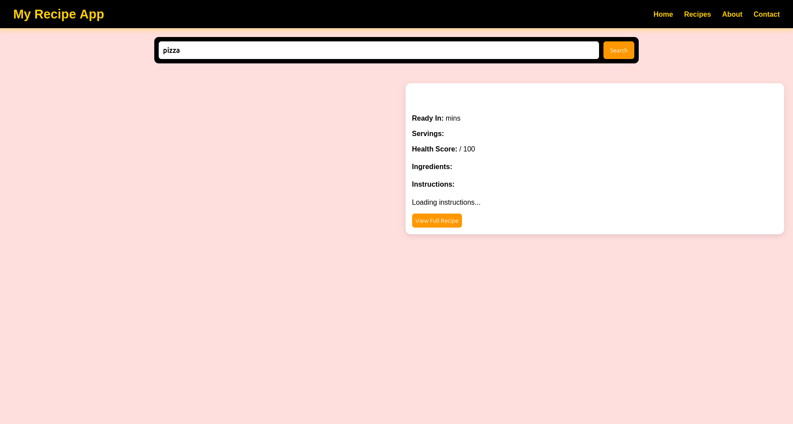
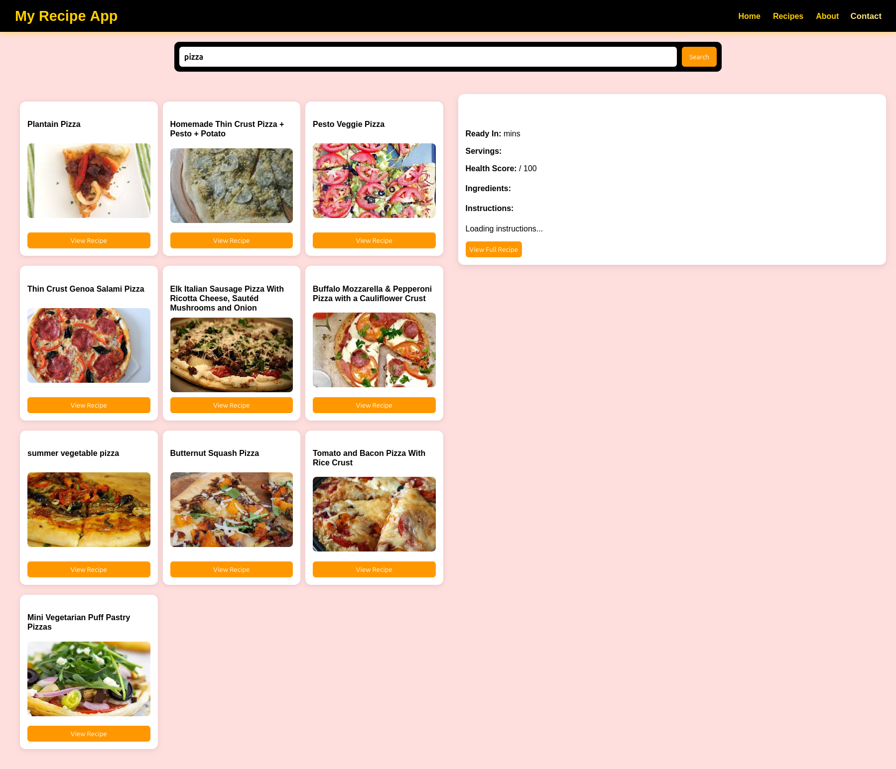
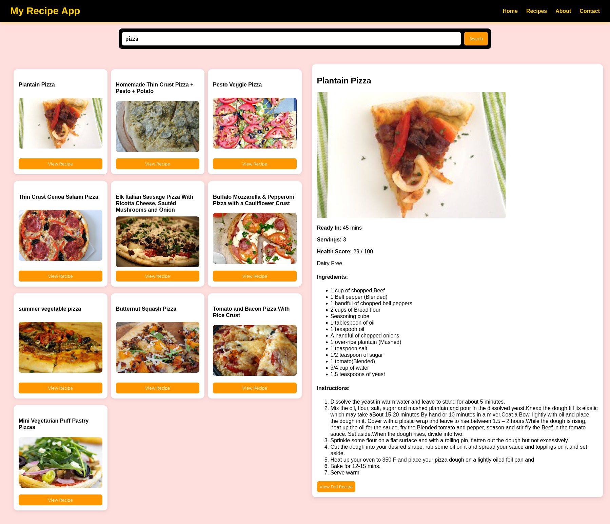

# 🍽️ Recipe Finder App

A modern and user-friendly web application that allows users to search for their favorite foods and explore detailed recipes with ease.

---

## 📌 Overview

The **Recipe Finder App** enables users to:

- Search for any food item (e.g., burger, pasta, pizza)
- View multiple variations and flavors of the searched food
- Access detailed recipes including:
  - Ingredients
  - Step-by-step cooking instructions
  - Additional recipe details

This application is designed to provide a seamless and intuitive experience for food lovers and home cooks.

---

## 🚀 Features

- 🔍 **Smart Search Functionality**  
  Easily search for any dish using keywords.

- 🍕 **Multiple Recipe Variations**  
  Discover different flavors and styles of a selected food item.

- 📖 **Detailed Recipe View**  
  Each recipe includes:
  - Ingredients list
  - Cooking instructions
  - Additional useful details

- ⚡ **Fast and Responsive UI**  
  Smooth user experience across devices.

---

## 🖼️ Screenshots

### 🏠 Homepage
Simple and clean interface for starting your search.



---

### 🔍 Search Results (Pizza)
Displaying multiple pizza variations based on user search.



---

### 📖 Recipe Details
Detailed view of a selected pizza recipe including ingredients and instructions.



---

## 🛠️ Tech Stack

- **Frontend:** React JS
- **Styling:**  CSS
- **API:** Recipe API  ([spoonacular Food API](https://spoonacular.com/food-api))

---

## 📂 Project Structure

```

recipe-app/
│
├── public/
│   ├── scr1.png
│   ├── scr2.png
│   └── scr3.png
│
├── src/
│   ├── components/
│   ├── pages/
│   └── utils/
│
├── package.json
└── README.md

````

---

## ⚙️ Installation & Setup

   ```bash
1. Clone the repository:

   git clone https://github.com/your-username/recipe-app.git

2. Navigate to the project directory:

    cd recipe-app


3. Install dependencies:

   npm install

4. Run the development server:

   npm run dev
````

 ## 🎯 Usage

1. Open the application in your browser.
2. Enter a food name (e.g., *pizza*).
3. Browse the list of available recipes.
4. Click on **"View Recipe"** to see detailed instructions.

---

## 📌 Future Improvements

* ❤️ Add favorite recipes feature
* 🛒 Shopping list generation
* 🌍 Filter recipes by cuisine or region
* 🔐 User authentication

---

## 🤝 Contributing

Contributions are welcome! Feel free to fork the repository and submit a pull request.

---

## 📄 License

This project is open-source and available under the MIT License.

---

## 👨‍💻 Author

Developed by **[ Muhammad Abdullah Akram ]**