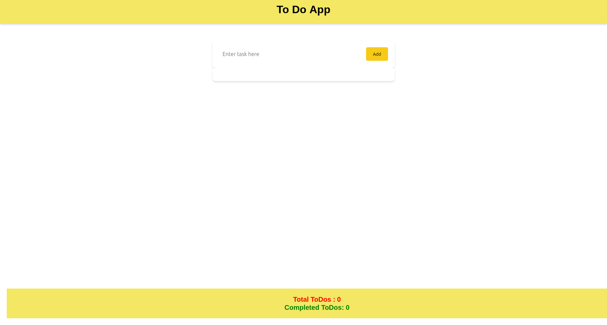
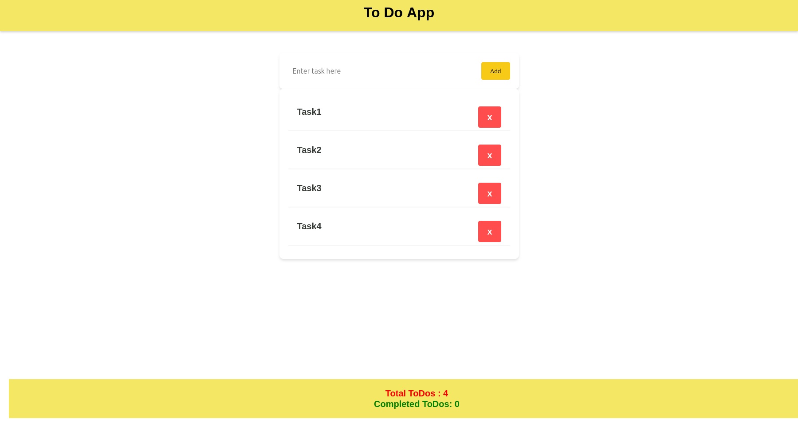
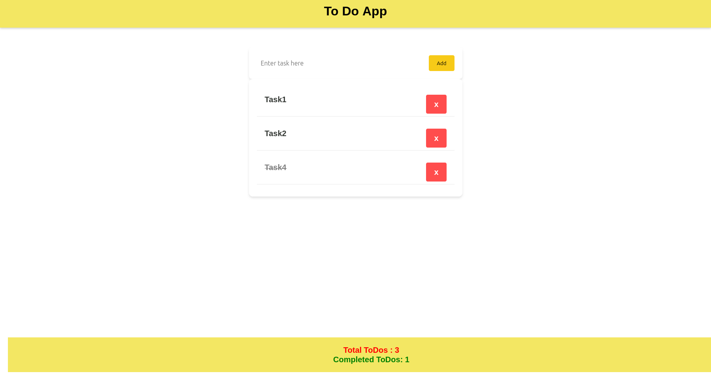

# ✅ To-Do App

A simple and interactive To-Do application that helps users manage daily tasks efficiently with a clean and intuitive interface.

---

## 📌 Overview

The **To-Do App** allows users to:

- Add multiple tasks
- Mark tasks as completed by clicking on them
- Delete tasks
- Track total and completed tasks in real-time

This app is designed to improve productivity with a minimal and user-friendly experience.

---

## 🚀 Features

- ➕ **Add Tasks**  
  Users can add multiple tasks dynamically.

- ✔️ **Mark as Completed**  
  Clicking on a task strikes through the text and marks it as completed.

- 🗑️ **Delete Tasks**  
  Easily remove tasks from the list.

- 📊 **Task Counter (Footer)**  
  Displays:
  - Total number of tasks  
  - Number of completed tasks  

- ⚡ **Responsive & Fast UI**  
  Smooth and responsive experience across devices.

---

## 🖼️ Screenshots

### 🏠 Homepage
Clean and simple interface to get started.



---

### ➕ Adding Tasks
User adding multiple tasks.



---

### ✔️ Completed Tasks
Tasks marked as completed with strike-through effect.


---

### 🗑️ Deleting Tasks
Removing tasks from the list.



---

### 📊 Footer (Task Summary)
Displays total and completed tasks.


---

## 🛠️ Tech Stack

- **Frontend:** React JS
- **Styling:**  CSS

---

## 📂 Project Structure

```
todo-app/
│
├── public/
│   ├── scr1.png
│   ├── scr2.png
│   ├── scr3.png
│   ├── scr4.png
│   └── scr5.png
│
├── src/
│   ├── components/
│   ├── pages/
│   └── utils/
│
├── package.json
└── README.md

````

---

## ⚙️ Installation & Setup

   ```bash
1. Clone the repository:
   git clone https://github.com/your-username/todo-app.git

2. Navigate to the project directory:

   cd todo-app

3. Install dependencies:

   npm install

4. Run the development server:

   npm run dev
````
---

## 🎯 Usage

1. Open the application in your browser.
2. Add a new task using the input field.
3. Click on a task to mark it as completed.
4. Click delete to remove a task.
5. View task statistics in the footer.

---

## 📌 Future Improvements

* 📝 Edit existing tasks
* 📅 Add due dates and reminders
* 🌙 Dark mode support
* ☁️ Save tasks using local storage or database

---

## 🤝 Contributing

Contributions are welcome! Feel free to fork the repository and submit a pull request.

---

## 📄 License

This project is open-source and available under the MIT License.

---

## 👨‍💻 Author

Developed by **[ Muhammad Abdullah Akram ]**